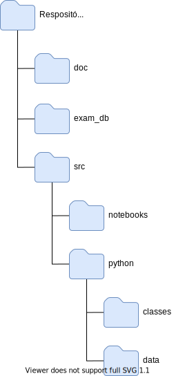

# Databricks Certification Simulators

Projeto de simulador da prova para certificação Databricks.

## Tecnologias

* Python 3;
* Notebooks Databricks.

## Usuários

Para usar o programa é recomendado possuir conhecimentos básicos em Python 3, Databricks Community(opcional) e Inglês.

## Simuladores

Este repositório possui 2 versões de simuladores:
- Versão para ser executada no computador local com Python 3;
- Versão em notebook para ser usada no ambiente Databricks Community.

Ambos os simuladores, assim como na prova real, disponibilizam um conjunto de 60 questões em que o usuário precisa responder em 2 horas.  

## Organização do Repositório



**doc**

Pasta com arquivos para auxiliar a documentação do repositório.

**exam_db**

A pasta `exam_db` contém os dados da prova, os dados do exame.  
Na pasta `exam_db` contém:

 - 1 arquivo de texto com as perguntas;
 - 1 arquivo de texto com as respostas (1 por linha);
 - 1 arquivo python que converte o conteúdo do arquivo com as questões no formato json e salva em um outro arquivo.

 *Observações*

- As informações contidas nessa pasta alimentam as bases de dados usadas pelos simuladores contidos neste repositório.  

- Os dados da prova foram extraídos do arquivo 'PracticeExam-DCADAS3-Python.pdf' salvo no Teams de estudo.

- O simulado também está disponível em https://files.training.databricks.com/assessments/practice-exams/PracticeExam-DCADAS3-Python.pdf  

 
**src**

A pasta `src` contém o código dos simuladores.

**notebooks**

A sub-pasta com 2 arquivos referentes ao simulado, um arquivo Jupyter Notebook com 60 perguntas originárias das provas de certificação para consulta e outro arquivo no formato dbc.

**python**

Guarda o código fonte da versão local do simulador. Possui duas sub-pastas:  

- classes: Código da implementação da classe Exam.
- data: Arquivos com os dados da prova. 1 arquivo json com as perguntas e 1 arquivo de texto com as respostas.

## Tratamento de dados

Como mencionado anteriormente, a pasta `exam_db` contém os dados do simulado.  
O programa python 'prg1.py' salvo na pasta transforma um arquivo de texto com as perguntas do simulado no formato JSON.  
Para o programa funcionar de modo adequado, o arquivo de texto de entrada precisa estar no seguinte formato:  

```txt
Question 1
Enunciado da questão 1
A. Opção 1
B. Opção 2
C. Opção 3
D. Opção 4
E. Opção 5
Question 2
Enunciado 
da questão 2
A. Descrição da
opção 1
B. Opção 2
C. Opção 3
D. Opção 4
E. Opção 5

...
```

O arquivo de saída possui a seguinte estrutura:  

```json
{
    "questions": [
        {
            "id": 1,
            "options": [
                "A. Opção 1",
                "B. Opção 2",
                "C. Opção 3",
                "D. Opção 4",
                "E. Opção 5"
            ],
            "description": "Enunciado da questão 1"
        },
    ]
}
```
*Observações*

- O arquivo de entrada 'questions_cert_spark.txt' salvo neste repositório está codificado no padrão 'charset: ANSI'. Isso pode gerar falhas de codificação para determinados caracteres, que podem ocasionar erros na leitura dos dados pelos simuladores.

## Simulador: Versão Notebook do Databricks

Na pasta `src/notebooks` existem 2 arquivos referentes ao simulado, um arquivo Jupyter Notebook com 60 perguntas e outro arquivo no formato dbc.

O arquivo dbc  pode ser importado no ambiente da Databricks Community. Esse arquivo possui compactado os seguintes notebooks:

- include/exam: Arquivo com a implementação da classe `Exam` com os dados da pergunta. Serve como base para execução dos demais notebooks. A classe `Exam` do notebook foi implementada de forma semelhante a implementação da versão para prompt de comando desse simulado.
- Exam1A: Arquivo com todas as perguntas do exame de forma ordenada, onde o usuário pode responder as perguntas e verificar sua quantidade de acertos.  
- Exam1B: Exibe de forma aleatória 1 pergunta por vez. O usuário pode responder as perguntas e no final do exame verificar sua quantidade de acertos. Funciona de forma semelhante a versão para shell desse simulado.

### Classe Exam

#### **Estados**


Em tempo de execução a classe apresenta 3 estados:

- "I" (Init), quando o objeto da classe é criado.
- "R" (Running), quando o teste é iniciado, `startExam()`
- "F" (Finished), quando o teste é finalizado, `stopExam()`

#### **Métodos**

Método|Argumentos|Descrição
------|----------|------------
getStatus()|N/A|Devolve o estado da classe.
setStatus(estado)|String. Letra que indica o estado|Método que altera o estado da aplicação.
cleanScreen()|N/A|Limpa o texto da tela de prompt de comando.
startExam()|N/A|Inicia o exame (prova).
stopExam()|N/A|Para o exame(prova). Mostra em tela o desempenho do usuário.
printQuestion()|N/A|Imprime uma questão da prova escolhida aleatóriamente.
checkUserAnswer(resposta)|String. Letra referente a resposta da prova ou a desistência do usuário.|Valida a resposta do usuário, acionando as ações apropriadas de acordo com a resposta recebida.  
loadQuestionsData()|N/A|Carrega os dados da prova
startTimeExam()|N/A|Inicia a contagem de tempo da prova.
checkTimeOver()|N/A|Verifica se o tempo da prova acabou.
getAnswers()|N/A|Devolve uma listas com as alternativas corretas para as questões

*Observações*

 - Os dados das questões foram implentados juntamente com o código, mas o ideal seria que os dados fossem obtidos de uma fonte externa.
 - No Teams há um vídeo de como usar os notebooks.
 - É necessário o refatoramento do código da classe atribuindo de forma coerente as responsabilidades dos métodos.

## Simulador: Versão para prompt de comando ou Shell

Na pasta `src/python` contém o código fonte para execução do simulado da prova localmente usando da python 3 no prompt de comando ou shell do sistema operacional.

### Arquivos da pasta src/python

- classes/exam.py: Código correspondente a classe que representa o exame.
- main.py: Arquivo que simula a aplicação do exame.
- data/*: Arquivos de dados com as questões.

### Formatos de arquivos de dados

**Arquivo com as questões**

```json
{
    "questions": [
        {
            "id": 1,
            "options": [
                "A. Option",
                "B. Option",
                "C. Option",
                "D. Option",
                "E. Option"
            ],
            "description": ""
        },
    ]
}
```

**Arquivo com as respostas**

```
1. A
2. B
...
```

### Classe *Exam*

#### **Estados**

A Classe **Exam** é o que permite a execução do simulado.  
Em tempo de execução ela apresenta 3 estados:

- "I" (Init), quando o objeto da classe é criado.
- "R" (Running), quando o teste é iniciado, `startExam()`
- "F" (Finished), quando o teste é finalizado, `stopExam()`


#### **Métodos**

Método|Argumentos|Descrição
------|----------|------------
getStatus()|N/A|Devolve o estado da classe.
setStatus(estado)|String. Letra que indica o estado|Método que altera o estado da aplicação.
cleanScreen()|N/A|Limpa o texto da tela de prompt de comando.
startExam()|N/A|Inicia o exame (prova).
stopExam()|N/A|Para o exame(prova). Mostra em tela o desempenho do usuário.
printQuestion()|N/A|Imprime uma questão da prova escolhida aleatóriamente.
checkUserAnswer(resposta)|String. Letra referente a resposta da prova ou a desistência do usuário.|Valida a resposta do usuário, acionando as ações apropriadas de acordo com a resposta recebida.  
loadQuestionsData(arq1, arq2)|String. arq1 e arq2|Método que recebe a localização do arquivo com os dados da perguntas, 'arq1' e o arquivo com os dados das respostas, 'arq2', e salva esse dados nos atributos '__questions' e '__answers'.


<u>Entradas válidas para 'checkUserAnswer'</u>

Entrada|Ação
-------|-----
'A', 'B', 'C', 'D' ou 'E'|Armazena a entrada pois refere-se a opção da prova escolhida pelo usuário
'Z'|Interrompe o exame.


*Observações*

- É necessário o refatoramento do código da classe atribuindo de forma coerente as responsabilidades dos métodos.
- No Teams há um vídeo demonstrando o uso desse simulador em ambiente Windows e Linux.  
